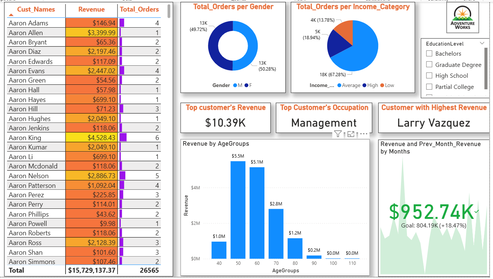

# Hi 👋, I'm Astuti Kumari

🎓 B.Sc Student | 📊 Aspiring Data Analyst | 📈 Passionate about turning data into business insights

---

# 📌 Project Overview

This project focuses on analyzing **Adventure Works Sales Data** and **Bank Loan Data** to uncover meaningful business insights using **Power BI, SQL, and Excel**.

The analysis helps businesses understand:

- Customer behavior
- Product performance
- Revenue trends
- Loan default risk
- Sales performance across categories

---

# ⚙️ Project Workflow

1. Data Cleaning using Excel  
2. SQL Data Analysis  
3. Dashboard Creation in Power BI  
4. KPI & Business Insight Generation  
5. Customer & Product Performance Analysis  

---

# 🚀 Skills Used

- Excel (Advanced)
- SQL
- Power BI
- Python (Pandas, NumPy)
- Statistics
- Data Cleaning
- Data Visualization

---

# 📊 Dashboard Preview

## 📌 Category Analysis Dashboard

- Analyzed revenue contribution by product categories
- Compared weekday vs weekend orders
- Identified high-return product segments
- Tracked sales KPIs and return metrics


---

## 📌 Product Analysis Dashboard

- Identified most profitable products
- Analyzed weekly profit trends
- Compared product returns over time
- Visualized country-wise order distribution


---

## 📌 Customer Analysis Dashboard

- Analyzed customer revenue contribution
- Compared income-category purchasing behavior
- Identified top customers and occupations
- Evaluated revenue trends across age groups



---

# 📈 Key Performance Indicators (KPIs)

| KPI | Value |
|------|------|
| Total Revenue | $15.73M |
| Total Orders | 27K |
| Quantity Sold | 39K |
| Total Returns | 1,828 |

---

# 🧠 SQL Business Questions Solved

1. How does credit score vary across age groups?
2. Which loan types have the highest repayment burden?
3. How does employment status affect loan default rate?
4. Is there a gender-based difference in default rate?
5. Which customer segments generate maximum revenue?

---

# 💻 SQL Query Example

```sql
SELECT
CASE
    WHEN Age BETWEEN 20 AND 30 THEN '20-30'
    WHEN Age BETWEEN 31 AND 40 THEN '31-40'
    WHEN Age BETWEEN 41 AND 50 THEN '41-50'
    WHEN Age BETWEEN 51 AND 60 THEN '51-60'
    ELSE '>60'
END AS GROUPS,

AVG(Credit_Score) AS AVG_CREDIT_SCORE

FROM Bank_loan

GROUP BY
CASE
    WHEN Age BETWEEN 20 AND 30 THEN '20-30'
    WHEN Age BETWEEN 31 AND 40 THEN '31-40'
    WHEN Age BETWEEN 41 AND 50 THEN '41-50'
    WHEN Age BETWEEN 51 AND 60 THEN '51-60'
    ELSE '>60'
END;

# 📞 Contact Me

- 💼 LinkedIn: https://linkedin.com/in/your-link
- 📧 Email: astuti@gmail.com
- 🌐 GitHub: https://github.com/Astuti99

