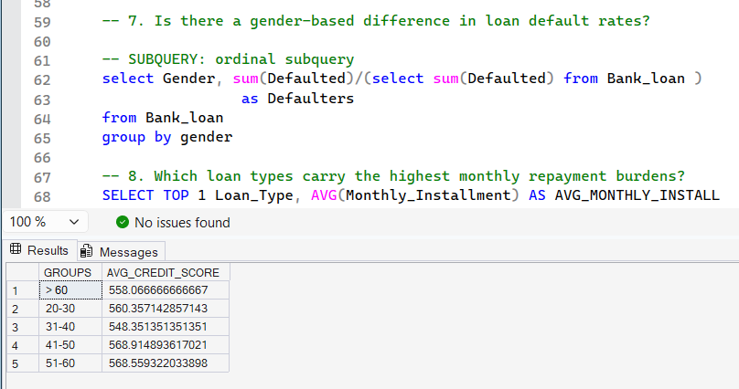
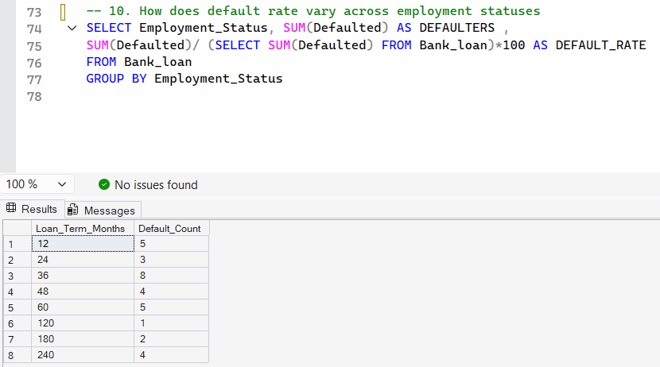

# Hi 👋, I'm Astuti Kumari

🎓 B.Sc Student | Aspiring Data Analyst
📊 Passionate about turning data into insights

---

## 🚀 Skills

* Excel (Advanced)
* SQL
* Power BI
* Python (Pandas, NumPy)
* Statistics

---

## 📊 Projects

### 🔹 Adventure Works Sales Dashboard

* Built interactive Power BI dashboard
* Analyzed sales, customers, and product performance
* Created KPIs and visual insights

### 🔹 Bank Loan Analysis

* Performed SQL-based analysis on loan dataset
* Identified default trends and risk patterns
* Built queries for business insights

---

## 📈 What I’m Working On

* Improving data visualization skills
* Building more real-world projects
* Learning advanced SQL & Python

---

## 📫 Contact Me

* LinkedIn: (Add your link here)
* Email: (your email)
* - GitHub: https://github.com/Astuti99

---

⭐ Always eager to learn and grow in Data Analytics!

## 📌 Business Problem

The company wants to understand:
- Which products generate the most revenue?
- Which customers contribute the highest value?
- What factors lead to loan defaults?
- How credit score, income, and employment affect risk

This analysis helps in:
- Improving sales strategy
- Reducing loan risk
- Identifying high-value customers

## 📊 Dataset Information

- Dataset: Adventure Works (Sales Data)
- Bank Loan Dataset (SQL Analysis)
- Records: ~XX rows
- Key Columns:
  - Customer_ID
  - Age
  - Credit_Score
  - Loan_Amount
  - Income
  - Product Category

## 📊 Dashboard Preview

## 📊 Product Analysis

## 📊 Customer Analysis

  📌 SQL Problem Statements

The following business questions were solved using SQL:

1. How does credit score vary across different age groups?
2. Is there a gender-based difference in loan default rates?
3. Which loan types have the highest monthly installment burden?
4. How does employment status affect loan default rates?

These queries helped uncover patterns in customer risk behavior and financial trends.
  
## 🗄️ SQL Analysis

📊 Query Explanation

- Used CASE WHEN to group customers into age categories
- Applied AVG() to calculate average credit score per group
- Used GROUP BY to compare trends across segments
- Implemented subqueries to calculate default percentage

This approach helped in understanding risk segmentation clearly.

🔍 Key Insights

- Bikes category contributes ~90% of total revenue (~$15M), making it the primary revenue driver
- Weekend sales are significantly higher in Accessories, indicating customer buying behavior patterns
- Customers aged 31–50 show higher and stable credit scores, making them low-risk borrowers
- Longer loan terms slightly increase default probability, indicating higher financial stress
- Lower income customers tend to have higher EMI burden, increasing default risk
- Customers in management roles generate the highest revenue contribution

## 🛠 Tools Used

- Power BI (Dashboard)
- SQL Server (Data Analysis)
- Excel (Data Cleaning)

## ✅ Conclusion

This project helped identify key business insights in sales and loan data.
It demonstrates strong skills in:
- Data cleaning
- SQL analysis
- Dashboard creation
- Business understanding

  🚀 Project Impact

- Helped identify high-revenue product categories for better sales targeting
- Provided insights into customer segments for risk-based loan approval
- Improved decision-making using data-driven insights

  📈 Future Improvements

- Build predictive model for loan default prediction
- Integrate real-time data for dynamic dashboard updates
- Perform customer segmentation using clustering techniques

